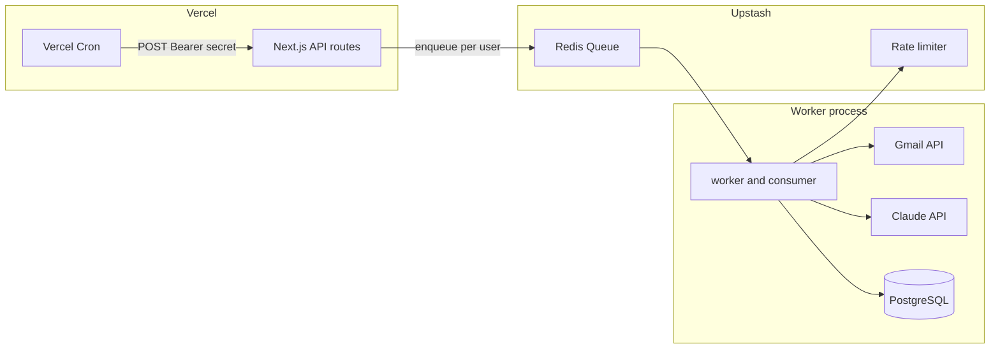

# StatisTrack architecture

This document describes how the optional **Gmail ingestion pipeline** fits together with the Next.js app. The UI and REST API work without it; the pipeline adds automated create/update of applications from email.

## High-level flow

## Components

### Web app (Next.js)

- **Session auth** — NextAuth with Prisma adapter; users and OAuth `Account` rows (Google refresh token used by the worker when present).
- **`/api/applications`** — CRUD for `JobApplication` scoped to the signed-in user.
- **`/api/cron/check-emails`** — `POST` only; expects `Authorization: Bearer <CRON_SECRET>`. Loads users in batches of 100 and enqueues one message per user (`{ userId }`) onto the Upstash queue with a small delay between sends.

### Queue and worker

- **`app/connection.ts`** — Configures Upstash **Redis**, a named **Queue** (`gmail_update_queue`) with `concurrencyLimit: 1`, and a **sliding-window rate limiter** (e.g. 20 requests per 20s) used when calling Gmail.
- **`app/worker.js`** — Loads env, then runs `consumeMessage()` from `consumer.ts` in a loop (long-running process; not the same as a serverless function timeout).
- **`app/consumer.ts`** — For each message: loads the user’s Google OAuth refresh token, lists Gmail messages since `User.gmailLastSynced` (or from a full sync if unset), fetches full messages, builds searchable text, scores it with keyword heuristics (`lib/emailTriggerWords.ts`). When the score passes a threshold, calls **`claudeResponse`** (`app/evalutation.ts`) with a prompt from `EMAIL_PARSE_PROMPT` to get **structured JSON** (company, job title, job id, location, type). Merges into Prisma: create or update `JobApplication` by `externalJobId` / company+position+location / fuzzy match, and updates `gmailLastSynced` when progress advances.

### AI layer

- **`app/evalutation.ts`** — Anthropic **Claude** (`claude-haiku-4-5-20251001`) with **JSON schema** output for predictable fields. Requires `CLAUDE_API_KEY`, `EMAIL_PARSE_PROMPT` (use `{email}` placeholder for the truncated message text), and `MAX_TOKENS`.

### Data model (relevant fields)

- **`User.gmailLastSynced`** — Cursor for incremental Gmail sync.
- **`JobApplication.externalJobId`** — When the model returns a stable id, used to match updates to the same application.

## Operational notes

- **Worker placement** — The consumer is designed to run as a **separate long-lived process** (or a container/service), not inside a short-lived serverless invocation, because it loops on the queue and may perform many Gmail + LLM calls per user.
- **Secrets** — Never commit `.env`. `CRON_SECRET` protects the cron route; Upstash and Anthropic keys must stay server-side.
- **Google Cloud** — Gmail API must be enabled and OAuth consent / scopes must include what you use for `gmail.readonly` (or as configured in your project); see [OAUTH_SETUP.md](./OAUTH_SETUP.md).

## Related docs

- [README.md](./README.md) — Overview and setup
- [SUPABASE_SETUP.md](./SUPABASE_SETUP.md) — Database URL and pooling
- [OAUTH_SETUP.md](./OAUTH_SETUP.md) — OAuth providers
- [VERCEL_DEPLOYMENT.md](./VERCEL_DEPLOYMENT.md) — Production deploy
